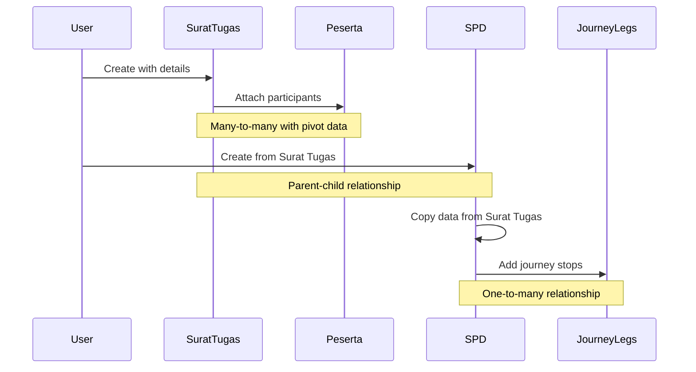
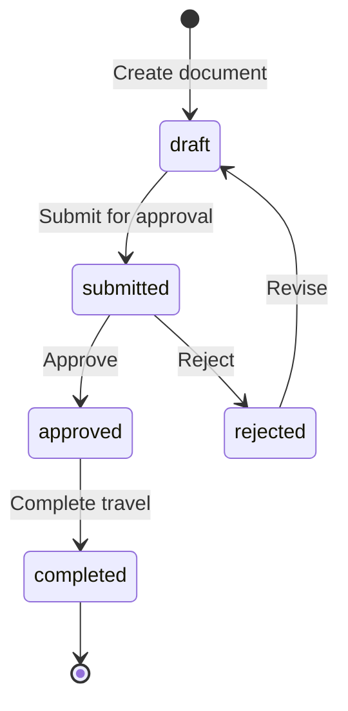

# Entity Relationship Diagram (ERD)
## Sistem Informasi Perjalanan Dinas

This document provides a visual representation of the database structure.

---

## ERD Diagram

```mermaid
erDiagram
    users ||--o{ surat_tugas : creates
    users ||--o{ surat_tugas : signs
    users }o--o{ surat_tugas : "participates in"
    users ||--o{ surat_perjalanan_dinas : "travels as pegawai"
    users ||--o{ surat_perjalanan_dinas : "acts as PPK"
    users ||--o{ surat_perjalanan_dinas : "acts as PPTK"
    
    surat_tugas ||--o{ surat_perjalanan_dinas : "generates"
    surat_tugas ||--o{ surat_tugas_peserta : "has"
    users ||--o{ surat_tugas_peserta : "is participant"
    
    surat_perjalanan_dinas ||--o{ spd_pengikut : "has followers"
    surat_perjalanan_dinas ||--o{ spd_perjalanan : "has journey legs"
    
    users {
        bigint id PK
        string name
        string email UK
        string password
        string nip UK "nullable"
        string nik "nullable"
        string pangkat "nullable"
        string golongan "nullable"
        string jabatan "nullable"
        string skpa "nullable"
        string eselon "nullable"
        text alamat "nullable"
        string no_telepon "nullable"
        timestamp email_verified_at "nullable"
        timestamp created_at
        timestamp updated_at
    }
    
    surat_tugas {
        bigint id PK
        string nomor_surat UK
        text dasar_hukum
        text maksud
        string tempat_tujuan
        string tempat_kegiatan "nullable"
        date tanggal_mulai
        date tanggal_selesai
        string kode_rekening
        string sub_kegiatan "nullable"
        bigint penandatangan_id FK "nullable"
        string penandatangan_nama "nullable"
        string penandatangan_nip "nullable"
        string penandatangan_jabatan "nullable"
        date tanggal_surat
        string tempat_surat
        enum status "draft,submitted,approved,rejected,completed"
        text catatan "nullable"
        bigint created_by FK
        timestamp created_at
        timestamp updated_at
        timestamp deleted_at "nullable"
    }
    
    surat_tugas_peserta {
        bigint id PK
        bigint surat_tugas_id FK
        bigint user_id FK
        string nama "nullable"
        string nip "nullable"
        string pangkat "nullable"
        string golongan "nullable"
        string jabatan "nullable"
        string skpa "nullable"
        integer urutan
        enum peran "ketua,anggota,pendamping"
        timestamp created_at
        timestamp updated_at
    }
    
    surat_perjalanan_dinas {
        bigint id PK
        bigint surat_tugas_id FK
        string nomor_spd UK
        string lembar_ke
        string kode_no "nullable"
        bigint ppk_id FK "nullable"
        string ppk_nama "nullable"
        string ppk_nip "nullable"
        string ppk_jabatan "nullable"
        bigint pegawai_id FK
        string pegawai_nama "nullable"
        string pegawai_nip "nullable"
        string pegawai_pangkat "nullable"
        string pegawai_golongan "nullable"
        string pegawai_jabatan "nullable"
        string pegawai_instansi "nullable"
        enum tingkat_biaya "A,B,C,D,nullable"
        text maksud_perjalanan
        string alat_transportasi
        string tempat_berangkat
        string tempat_tujuan
        integer lama_perjalanan_hari
        date tanggal_berangkat
        date tanggal_kembali
        string kegiatan_instansi "nullable"
        string akun_kode_rekening
        string mata_anggaran "nullable"
        text keterangan "nullable"
        bigint pptk_id FK "nullable"
        string pptk_nama "nullable"
        string pptk_nip "nullable"
        string pptk_jabatan "nullable"
        date tanggal_spd
        string tempat_spd
        enum status "draft,submitted,approved,rejected,completed"
        timestamp created_at
        timestamp updated_at
        timestamp deleted_at "nullable"
    }
    
    spd_pengikut {
        bigint id PK
        bigint surat_perjalanan_dinas_id FK
        string nama
        date tanggal_lahir "nullable"
        text keterangan "nullable"
        integer urutan
        timestamp created_at
        timestamp updated_at
    }
    
    spd_perjalanan {
        bigint id PK
        bigint surat_perjalanan_dinas_id FK
        integer urutan
        string berangkat_dari "nullable"
        string ke "nullable"
        date pada_tanggal "nullable"
        string kepala_nama "nullable"
        string kepala_nip "nullable"
        string kepala_jabatan "nullable"
        string tiba_di "nullable"
        date tiba_tanggal "nullable"
        string tiba_kepala_nama "nullable"
        string tiba_kepala_nip "nullable"
        string tiba_kepala_jabatan "nullable"
        text keterangan "nullable"
        timestamp created_at
        timestamp updated_at
    }
```



---

## Relationships Explanation

### 1. Users ↔ Surat Tugas

**Multiple Relationships:**

- **Creator (1:N)**: One user can create many surat tugas
  ```php
  $user->suratTugasCreated // HasMany
  ```

- **Signatory (1:N)**: One user can sign many surat tugas as penandatangan
  ```php
  $user->suratTugasSigned // HasMany
  ```

- **Participants (M:N)**: Many users can be participants in many surat tugas
  ```php
  $user->suratTugasPeserta // BelongsToMany
  $suratTugas->peserta // BelongsToMany
  ```

### 2. Surat Tugas ↔ Surat Perjalanan Dinas

**Parent-Child (1:N)**: One surat tugas can generate multiple SPD documents
```php
$suratTugas->suratPerjalananDinas // HasMany
$spd->suratTugas // BelongsTo
```

### 3. Users ↔ Surat Perjalanan Dinas

**Multiple Relationships:**

- **Traveler (1:N)**: One user can have many SPD as pegawai (traveler)
  ```php
  $user->suratPerjalananDinas // HasMany
  ```

- **PPK (1:N)**: One user can be PPK for many SPD
  ```php
  $user->spdAsPpk // HasMany
  ```

- **PPTK (1:N)**: One user can be PPTK for many SPD
  ```php
  $user->spdAsPptk // HasMany
  ```

### 4. Surat Perjalanan Dinas ↔ SPD Pengikut

**Parent-Child (1:N)**: One SPD can have many followers
```php
$spd->pengikut // HasMany
$pengikut->suratPerjalananDinas // BelongsTo
```

### 5. Surat Perjalanan Dinas ↔ SPD Perjalanan

**Parent-Child (1:N)**: One SPD can have many journey legs
```php
$spd->perjalanan // HasMany
$perjalanan->suratPerjalananDinas // BelongsTo
```

---

## Data Flow

### Document Creation Workflow



### Status Workflow



---

## Key Design Patterns

### 1. Snapshot Pattern

When creating documents, user data is copied into the document tables:

```php
// Example: SPD stores pegawai data as snapshot
'pegawai_id' => $user->id,          // Foreign key reference
'pegawai_nama' => $user->name,      // Snapshot at creation time
'pegawai_nip' => $user->nip,        // Snapshot at creation time
'pegawai_pangkat' => $user->pangkat,// Snapshot at creation time
```

**Why?** Historical accuracy. Even if the user's profile changes, the document shows data as it was at creation time.

### 2. Flexible References

Some relationships allow both foreign key and manual entry:

```php
// Can reference a user OR enter manually
'penandatangan_id' => $user->id,     // If user exists in system
'penandatangan_nama' => 'John Doe',  // Or enter manually
'penandatangan_nip' => '123456',     // Manual entry
```

**Why?** Not all officials may be system users. This allows flexibility.

### 3. Pivot Table with Extra Columns

`surat_tugas_peserta` is not just a simple pivot:

```php
// Standard pivot fields
'surat_tugas_id' => 1,
'user_id' => 5,

// Extra fields
'urutan' => 1,              // Order/sequence
'peran' => 'ketua',        // Role (leader/member)
'nama' => 'Snapshot',      // Data snapshots
'nip' => 'Snapshot',
// ... more snapshots
```

**Why?** Maintains order, defines roles, and preserves historical data.

### 4. Soft Deletes

Main document tables use `SoftDeletes`:

- `surat_tugas`
- `surat_perjalanan_dinas`

**Why?** Audit trail and data recovery. Documents are never truly deleted.

---

## Indexes for Performance

Recommended indexes (not in migrations, add manually if needed):

```sql
-- Users table
CREATE INDEX idx_users_nip ON users(nip);
CREATE INDEX idx_users_nik ON users(nik);

-- Surat Tugas table
CREATE INDEX idx_st_status ON surat_tugas(status);
CREATE INDEX idx_st_created_by ON surat_tugas(created_by);
CREATE INDEX idx_st_tanggal ON surat_tugas(tanggal_mulai, tanggal_selesai);

-- SPD table
CREATE INDEX idx_spd_status ON surat_perjalanan_dinas(status);
CREATE INDEX idx_spd_pegawai ON surat_perjalanan_dinas(pegawai_id);
CREATE INDEX idx_spd_tanggal ON surat_perjalanan_dinas(tanggal_berangkat, tanggal_kembali);

-- Pivot table
CREATE INDEX idx_peserta_surat ON surat_tugas_peserta(surat_tugas_id);
CREATE INDEX idx_peserta_user ON surat_tugas_peserta(user_id);
```

---

## Sample Queries

### Get Surat Tugas with all participants

```php
$suratTugas = SuratTugas::with(['peserta' => function($query) {
    $query->orderBy('urutan');
}])->find($id);

foreach ($suratTugas->peserta as $peserta) {
    echo "{$peserta->pivot->urutan}. {$peserta->name} - {$peserta->pivot->peran}\n";
}
```

### Get SPD with complete journey details

```php
$spd = SuratPerjalananDinas::with([
    'suratTugas',
    'pegawai',
    'ppk',
    'pptk',
    'pengikut',
    'perjalanan' => function($query) {
        $query->orderBy('urutan');
    }
])->find($id);
```

### Get all travels for a user

```php
$user = User::with([
    'suratTugasPeserta',
    'suratPerjalananDinas'
])->find($id);

// All surat tugas where user is participant
$userTravels = $user->suratTugasPeserta;

// All SPD where user is the traveler
$userSpd = $user->suratPerjalananDinas;
```

### Get pending approvals

```php
$pendingApprovals = SuratTugas::with('peserta')
    ->where('status', 'submitted')
    ->orderBy('tanggal_surat', 'desc')
    ->get();
```

---

## Validation Rules Reference

### Surat Tugas Validation

```php
[
    'nomor_surat' => 'required|string|max:50|unique:surat_tugas',
    'dasar_hukum' => 'required|string',
    'maksud' => 'required|string',
    'tempat_tujuan' => 'required|string|max:255',
    'tanggal_mulai' => 'required|date',
    'tanggal_selesai' => 'required|date|after_or_equal:tanggal_mulai',
    'kode_rekening' => 'required|string|max:50',
    'penandatangan_id' => 'nullable|exists:users,id',
    'peserta' => 'required|array|min:1',
    'peserta.*.user_id' => 'required|exists:users,id',
    'peserta.*.peran' => 'required|in:ketua,anggota,pendamping',
]
```

### SPD Validation

```php
[
    'surat_tugas_id' => 'required|exists:surat_tugas,id',
    'nomor_spd' => 'required|string|max:50|unique:surat_perjalanan_dinas',
    'pegawai_id' => 'required|exists:users,id',
    'ppk_id' => 'nullable|exists:users,id',
    'pptk_id' => 'nullable|exists:users,id',
    'tingkat_biaya' => 'nullable|in:A,B,C,D',
    'alat_transportasi' => 'required|string|max:100',
    'tempat_berangkat' => 'required|string|max:100',
    'tempat_tujuan' => 'required|string|max:100',
    'tanggal_berangkat' => 'required|date',
    'tanggal_kembali' => 'required|date|after_or_equal:tanggal_berangkat',
    'lama_perjalanan_hari' => 'required|integer|min:1',
]
```

---

*This ERD is generated from the database schema version dated January 21, 2025*
